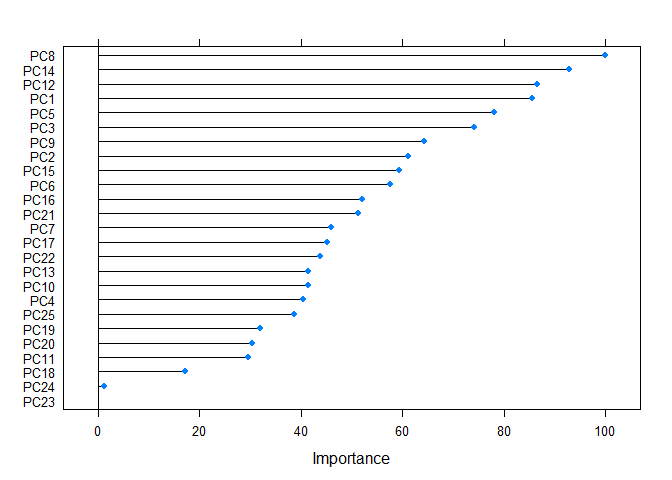

# Practical Machine Learning
Malgorzata M. Jakubowska  
15 September 2016  


The aim of the following report is to provide the reader with the overview of the process of building a machine learning algorithm based on the Weight Lifting Exercise Dataset (Velloso, Bulling, Gellersen, Ugulino & Fuks, 2013). As opposed to predicting the type of activity performed, the algorithm is thought to model the "goodness" of the performance, which is a new strain of the human activity recognition studies. The report will cover the buliding procedure step by step. 
####
The Weight Lifting Exercise Dataset includes data collected from six participants performing the Unilateral Dumbbell Biceps Curl in five distinct ways. Those ways correspond to the "classe" variable, which is supposed to be predicted by other variables from the dataset. Class A is assigned to a perfect performance and Classes B-E reflect different errors. Apart from the "classe" variable both sets (training and test) contain 159 variables. There are 19622 observations in the training set and 20 in the test set.

##Data reading
The first step was to read the data into R.

```r
training<- read.csv("pml-training.csv")
testing<- read.csv("pml-testing.csv")
```

##Data pre-processing
Due to lack of factor variables other than "classe" no dummy variables were needed. However, zero and near zero-variance predictors as well as variables with NA values need to be identified:


```r
#reading necessary packages
library(caret)
```

```
## Loading required package: lattice
```

```
## Loading required package: ggplot2
```

```r
#identifying near zero-variance predictors
near0<-nzv(training)
training3<- training[, -near0]
#removing variables with NA values
training4<-Filter(function(x)!any(is.na(x)), training3)
#removing first six variables (user name, timestamps, window)
training5<- training4[, c(7:59)]
```


##Modeling
The resulting training dataset consists of 53 variables instead of the initial 160. The next step is to further pre-process the data. Having in mind that the training set includes rather large amount of variables, principal component analysis can be applied to possibly reduce the number of variables, so the model training and tuning will be easier to perform. However, since k-fold cross validation will be used, preProcess function will not be calculated separately, but passed as an argument in the train function later, so the PCA is applied to every fold.

An important point must be made here. Due to the possibility of overloading R with excessive amount of data, the following code was used to enable usage of parallel processing.


```r
library(parallel)
library(doParallel)
```

```
## Loading required package: foreach
```

```
## Loading required package: iterators
```

```r
cluster<-makeCluster(detectCores()-1)
registerDoParallel(cluster)
```

Running this chunk of code should shorten the time needed to perform the next steps of modeling. 

Next, trainControl function is used to generate parameters to later be passed to the train function. The resampling method is k-fold cross-validation with k parameter set to 10. 


```r
control <- trainControl(method = "cv",
                 number = 10,
                 allowParallel = TRUE)
```

Now, the initial model training can be performed with the following code. First, seed is set to ensure reproducibility. The model will be trained using random forest approach, following the article by Velloso et al. (2013) in which this procedure was also used. Additionally, as was mentioned before, preProcess function is a part of chunk above, in order to ensure that the principal component analysis is applied to every fold. 


```r
set.seed(1000)
fit <- train(classe~., method="rf",data=training5, preProcess=c("pca"), trControl = control)
```

```
## Loading required package: randomForest
```

```
## randomForest 4.6-12
```

```
## Type rfNews() to see new features/changes/bug fixes.
```

```
## 
## Attaching package: 'randomForest'
```

```
## The following object is masked from 'package:ggplot2':
## 
##     margin
```

```r
fit
```

```
## Random Forest 
## 
## 19622 samples
##    52 predictor
##     5 classes: 'A', 'B', 'C', 'D', 'E' 
## 
## Pre-processing: principal component signal extraction (52), centered
##  (52), scaled (52) 
## Resampling: Cross-Validated (10 fold) 
## Summary of sample sizes: 17660, 17659, 17660, 17660, 17661, 17660, ... 
## Resampling results across tuning parameters:
## 
##   mtry  Accuracy   Kappa    
##    2    0.9819584  0.9771757
##   27    0.9725819  0.9653189
##   52    0.9722252  0.9648670
## 
## Accuracy was used to select the optimal model using  the largest value.
## The final value used for the model was mtry = 2.
```

```r
fit$finalModel
```

```
## 
## Call:
##  randomForest(x = x, y = y, mtry = param$mtry) 
##                Type of random forest: classification
##                      Number of trees: 500
## No. of variables tried at each split: 2
## 
##         OOB estimate of  error rate: 1.67%
## Confusion matrix:
##      A    B    C    D    E class.error
## A 5554    7   13    3    3 0.004659498
## B   51 3714   27    0    5 0.021859363
## C    4   34 3358   23    3 0.018702513
## D    4    2  105 3100    5 0.036069652
## E    0    7   20   12 3568 0.010812309
```

As can be seen in the output, all predictors were centered, scaled and used in the principal component analysis. The resampling method was 10-fold cross-validation. The final mtry parameter chosen was 2, which means that two variables were tried at each split in the classification tree. 
Accuracy of the final model is 0.982, Kappa is equal to 0.977 and out-of-sample error is 1.67%. It can be concluded that the model performance is satisfactory. 

Below variable importance plot (based on variables resulting from the PCA) and the confusion matrix can be seen .


```r
imp<-varImp(fit)
plot(imp)
```

<!-- -->

```r
confusionMatrix(fit)
```

```
## Cross-Validated (10 fold) Confusion Matrix 
## 
## (entries are percentual average cell counts across resamples)
##  
##           Reference
## Prediction    A    B    C    D    E
##          A 28.3  0.3  0.0  0.0  0.0
##          B  0.0 18.9  0.2  0.0  0.1
##          C  0.1  0.1 17.1  0.6  0.1
##          D  0.0  0.0  0.2 15.8  0.1
##          E  0.0  0.0  0.0  0.0 18.1
##                            
##  Accuracy (average) : 0.982
```

         
The final step would be to predict the "classe" variable on the test set by inputting the following code:


```r
prediction<-predict(fit, testing)
prediction
```

```
##  [1] B A A A A E D B A A B C B A E E A B B B
## Levels: A B C D E
```

All in all, it can be said that random forest model performance on the Weight Lifting Exercise Dataset is accurate and satisfactory.


